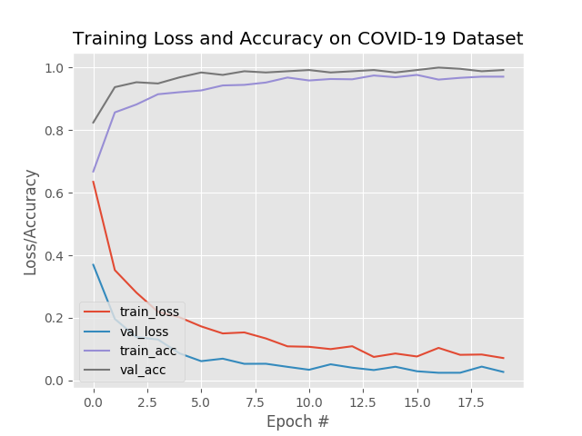
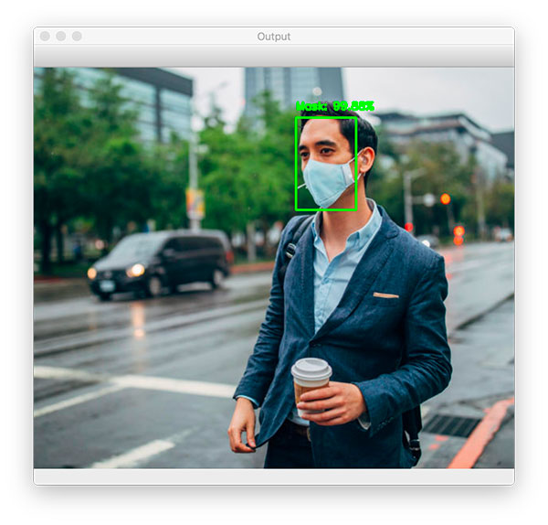

# face-mask-detection
Đây là project nhận diện khuôn mặt đeo khẩu trang sử dụng OpenCV, Deep Learning. Project có tính ứng dụng rất phù hơp trong thời kì dịch Covid19 đang có diễn biến phức tạp trên toàn thế giới
## Libraries
'''
Python
OpenCV
Tensorflow
'''

## Training process
 
## Results
Images

