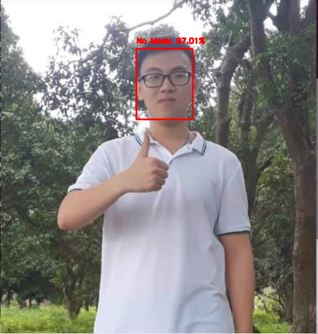
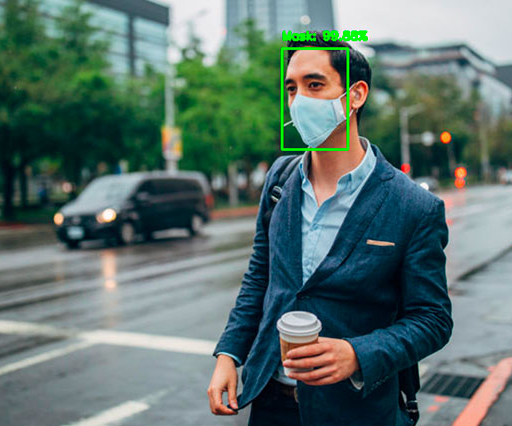

# face-mask-detection
This is a face masks detection project using OpenCV, Deep Learning. The application is very suitable in Covid19 translation period which is happening complicatedly around the world.
## Libraries

* Python
* OpenCV
* Tensorflow
* Recommend: Ubuntu(OS)

## Results
### No mask

### With mask

## Usage
### Step 1:
Clone this repository
### Step 2:
Train model
```
$ python train_mask_detector.py --dataset dataset
```
### Step 3:
Predict with images
```
$ python detect_mask_image.py --image examples/[image-name].png
```
### Step 4:
Predict with real-time video streams
```
$ python detect_mask_video.py
```
